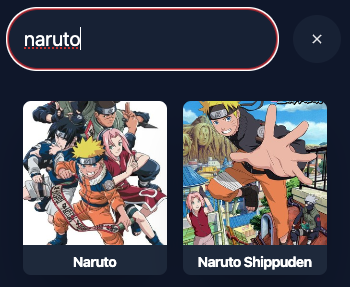

# API for Anime Websites
This is an API for anime websites. It is a simple API that can be used to search anime titles on multiple websites. The API is written in Python and uses LiteStar.

```bash
curl -X GET "http://localhost:8000/streaming-links?anime_id=naruto&episode_no=1&provider=0"
```
```json
"data": {
    "last_ep": 220,
    "url": "https://example.com/stream1.m3u8"
}
```

> Before deploying, please update the app/scrapper/config.py file OR provide the environment variables for the app to work. See Installation for more details.

## Installation
1. Clone the repository
```bash
git clone https://github.com/RobinPourtaud/anime-api
```

2. Install the requirements 
```bash
pip install -r requirements.txt
```

3. Set the environment variables OR/AND Update config.py
```bash
#If you use the gogoanime scrapper
export PROVIDER_GOGO=https://anime.com,https://anime2.com

#If you want to specify another scrapper, you will have to develop it yourself
export SCRAPPER=GogoAnime
```

4. Debug the app
```bash
Litestar run --debug
```
4. Or run the app
```bash
Litestar run
```
You can also deploy using the Dockerfile...


## Supported Websites
- **gogoanime** (the URL ARE NOT PROVIDED, see Installation)


## Routes
### Search [GET]
Search for an anime title on the supported websites.

**API Endpoint:** `/search`

**Query Parameters:**
- `q` : The title of the anime to search for.
- `max_res` : The maximum number of results to return. Default is 5.`
- `provider` : An int, the index of the PROVIDER variable. Need to be provided by you.



The frontend is not provided here.

**Response:**
```json
{
    "status": "success",
    "data": [
        {
            "title": "Naruto",
            "url": "https://example.com/naruto.png",
            "id": "naruto"
        },
        {
            "title": "Naruto: Shippuden",
            "url": "https://example.com/naruto-shippuden.png",
            "id": "naruto-shippuden"
        }
    ]
}
```

### Get Stream Links [GET]
Get the stream links for an anime episode.

**API Endpoint:** `/streaming-links`

**Query Parameters:**
- `anime_id` : The id of the anime. This is the id returned in the search response.
- `episode_no` : The episode number to get the stream links for.
- `provider` : An int, the index of the PROVIDER variable. Need to be provided by you.

**Response:**
```json
{
    "status": "success",
    "data": [
        {
            "last_ep": 220,
            "url": "https://example.com/stream1.mp4"
        },
        
    ]
}
```

### Other Routes
All the other routes are in the app/scrapper/api.py file


## Add a scrapper
You can participate by adding a file in the scrapper folder. 
The scrapper should be a class that inherits from the Scrapper class in the app/scrapper/__init__.py file.

